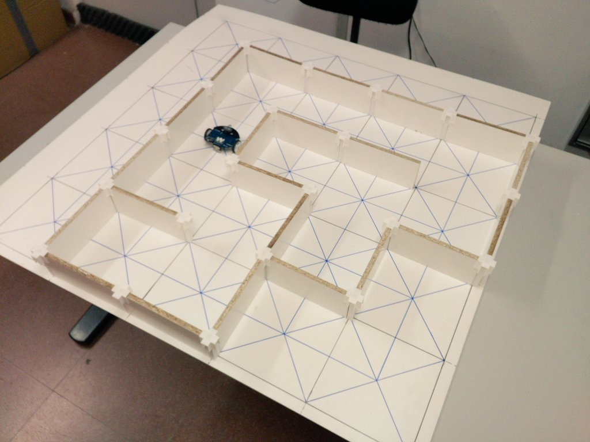
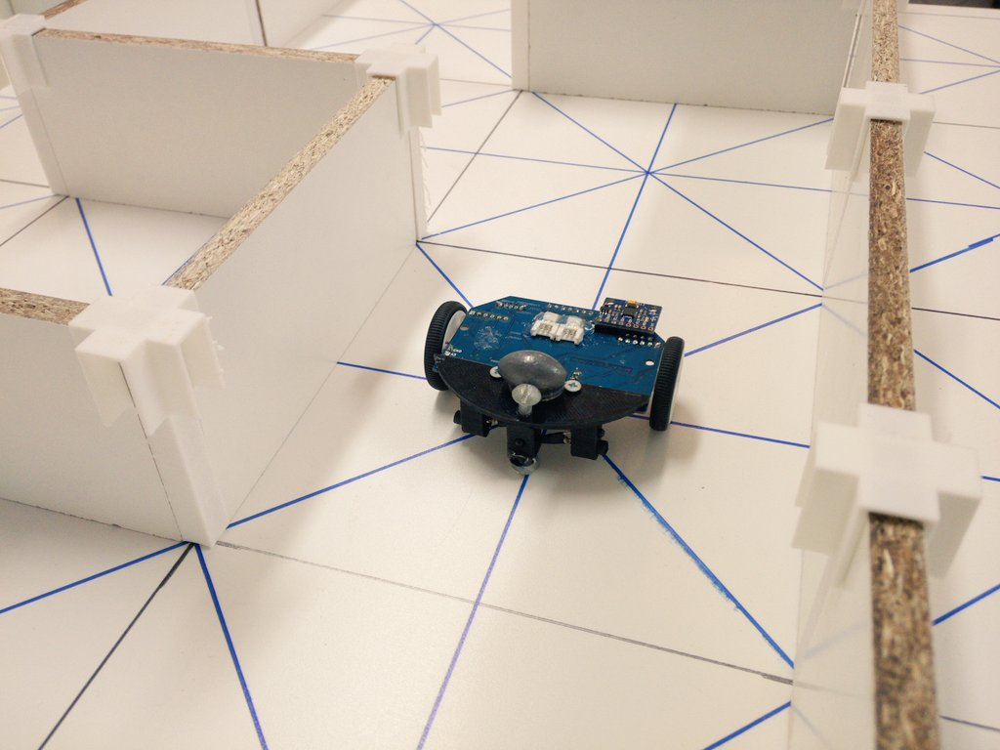
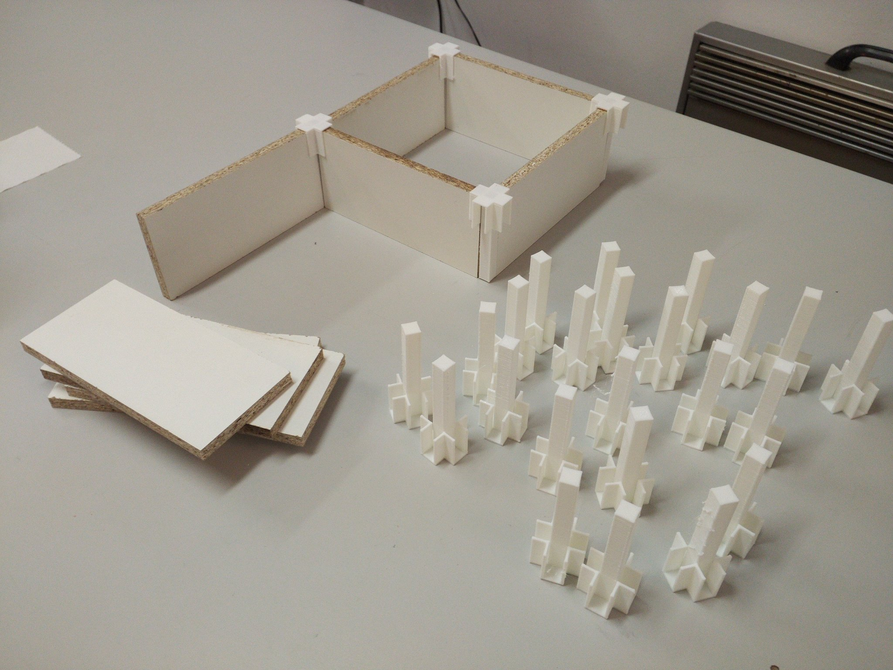
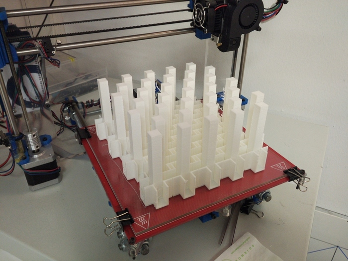

# Pilares para el laberinto de la OSHWDem 2017

# Instrucciones

- Cortar tablillas de dimensión 170x80x10mm. Esto lo hacen gratis en la tienda AKI, a partir de tablas de madera conglomerada con laminación blanca.
- Imprimir las columnas de soporte y montarlo como en las fotos.

# Nota: El grosor de las paredes oficiales es 12mm en vez de 10mm). La cuadrícula tiene el mismo tamaño.
