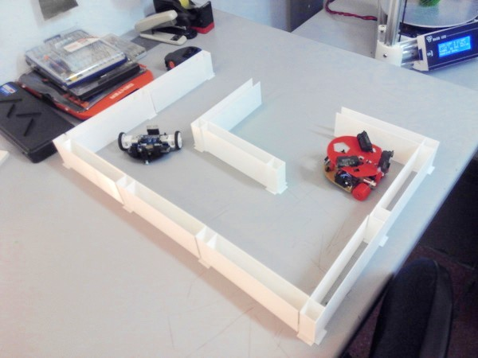
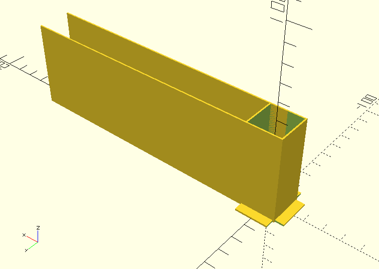
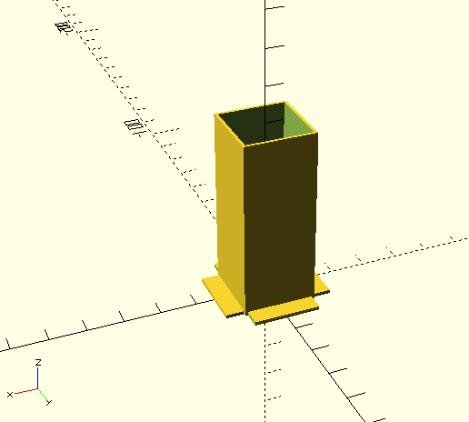
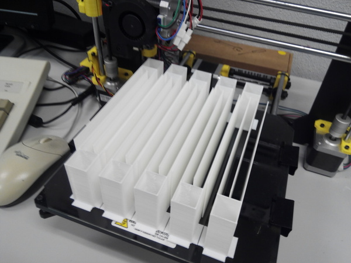
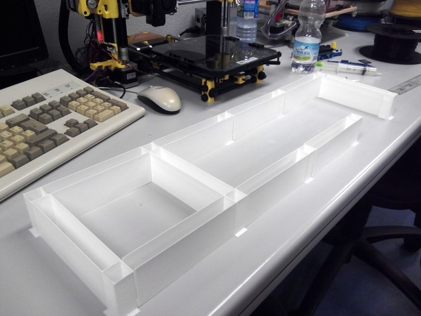

Paredes modulares para probar el laberinto de la OSHWDem
=

Dentro de poco es la OSHWDem Coruña (<http://oshwdem.org/>), el mayor evento que fomenta la tecnología abierta en España.

Una de las competiciones es el laberinto (<http://rules.oshwdem.org/labirinto_es>). Para poder participar, necesitábamos un laberinto en el que probar los robots con cierta antelación.

Para ello hemos diseñado el siguiente sistema paramétrico con las medidas reales que se utilizarán en la competición. Esperemos que os sea de utilidad, y... ¡nos vemos en la OSHWDem! :-)

¡¡¡OJO!!! Las paredes_laberinto.stl son 1cm más largas de la cuenta! Sentimos las molestias que esto haya podido ocasionar... Nos hemos dado cuenta tarde :-S
--

Descarga el diseño
=

- Código fuente OpenSCAD: [paredes_laberinto.scad](paredes_laberinto.scad)
- STL de la pieza suelta: [pieza_suelta.stl](pieza_suelta.stl)
- STL de la base de imprusión: [paredes_laberinto.stl](paredes_laberinto.stl)

Más fotos
=

  
*El diseño permite imprimir muchas piezas juntas*  

Diseñado por Víctor Uceda (@VictorUceda), Eduardo Hilario (@eduhs) y Carlos García (@CarlosGS)

Club de Robótica-Mecatrónica, Universidad Autónoma de Madrid (<http://crm.ii.uam.es>)

Licencia: Public Domain

