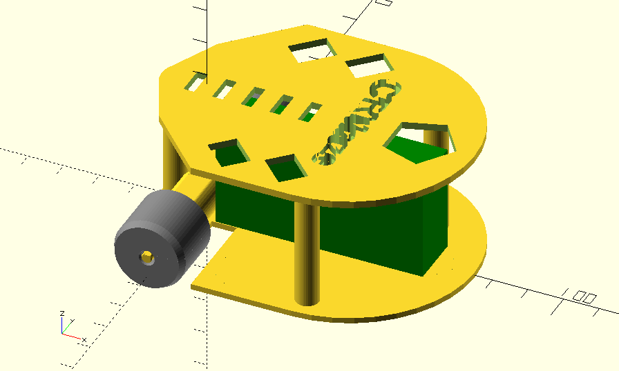

# CRMaze
Open source robot for maze solving + line following

  

  

Authors
--
**Víctor Uceda & Carlos García**  
Club de Robótica-Mecatrónica, Universidad Autónoma de Madrid (CRM-UAM)  
<http://crm-uam.github.io>  

License
--
License: **Attribution - Share Alike - Creative Commons (<http://creativecommons.org/licenses/by-sa/4.0/>)**  

Disclaimer  
--
This hardware/software is provided "as is", and you use the hardware/software at your own risk. Under no circumstances shall any author be liable for direct, indirect, special, incidental, or consequential damages resulting from the use, misuse, or inability to use this hardware/software, even if the authors have been advised of the possibility of such damages.  

